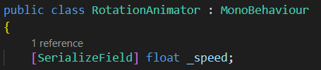
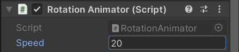

# Unity Tutorium
Dieses Repository dient für ein Tutorium an der Hochschule Furtwangen zur Einführung in Unity.

## 1 Szenen, Objekte und Komponenten
Eine Szene in Unity ist eine Menge von Objekten, die in einer Baumstruktur angeordnet sind. Wenn eine Szene erstellt wird, oder auch die <i>SampleScene</i> mit der ein Projekt beginnt, dann enthält diese bereits zwei Objekte. Jeweils eine <i>Main Camera</i> und ein <i>Directional Light</i>. Die Kamera nimmt das Bild im Spiel auf und das Licht simuliert die Sonne.

Wenn wir ein Objekt einer Szene hinzufügen wollen geht das über den <b>+</b>-Button vom <i>Hierarchy</i>-Fenster oder Rechtscklick in das Fenster hinein. Dann gibt es die Auswahl zwischen einem leerem Objekt und unterschiedlichen Kategorien von Objekten. Dreidimensionale Körper können in der Kategorie <i>3D Object</i> gefunden werden.

Objekte in einer Szene können untergeordnete Objekte haben, daher die Baumstruktur. Wenn wir einem Objekt ein untergeordnetes Objekt hinzufügen wollen, ist das über Rechtsklick auf das Objekt im <i>Hierarchy</i>-Fenster möglich oder wir ziehen per Drag-and-Drop ein bestehendes Objekt auf ein anderes. Wenn wir Objekte verschieben, drehen oder skalieren wollen, geht das entweder über die Werkzeuge im Szenenfenster oder über die Eigenschaften <i>Position</i>, <i>Rotation</i> und <i>Scale</i> in der <i>Transform</i>-Komponente eines Objekts. Jetzt können wir zum Beispiel eine Szene mit Würfeln wie in der folgenden Abbildung aufbauen.

Diese Szene ist bis jetzt noch statisch. Selbst wenn wir im Unity-Editor auf den Play-Button drücken, passiert nichts. In Unity können Objekten über Komponenten Funktionalität hinzugefügt werden. Tatsächlich besitzen die Objekte in dieser Szene schon Komponenten. Die <i>Main Camera</i> hat die Komponenten <i>Camera</i> und <i>Audio Listener</i>, das <i>Direction Light</i> hat die Komponente <i>Light</i> und unsere Würfel haben die Komponenten <i>Mesh Filter</i>, <i>Mesh Renderer</i>, <i>Box Collider</i> und <i>Material</i>. Außerdem hat jedes <i>GameObject</i> in Unity immer eine <i>Transform</i>-Komponente. Wenn wir eine Komponente hinzufügen wollen geht das mit dem <i>Add Component</i>-Button nach der letzten Komponente eines Objekts.

Wenn wir jetzt zum Beispiel den Boden drehen lassen wollen, können wir nach einer Komponente <i>RotationAnimator</i> suchen. So eine Komponente gibt es nicht Unity, aber wir haben die möglichkeit über den Button <i>New script</i> ein neues C#-Skript zu erstellen und dieses direkt als Komponente dem Objekt hinzuzufügen. Wenn wir das gemacht haben, finden wir jetzt das Skript auch in dem Projektfenster unter dem Ordner <i>Assets</i>. Hier können wir auch einen neuen Ordner erstellen über den <b>+</b>-Button, oder indem wir in einem Ordner Rechtsklicken und auf <i>Create</i> gehen, und jeweils <i>Folder</i> auswählen. So kann auch ein Ordner für die C#-Skripte erstellt werden um unser Projekt etwas organisierter zu halten. Mit Doppelklick auf das Skript im Projektfenster oder Klick auf die Pünktchen von der Komponente im <i>Ispector</i> und Auswahl von <i>Edit Script</i>, kann das Skript zur Bearbeitung geöffnet werden. Ein neues Skript sieht vorerst wie in der folgenden Abbildung aus.

Wir sehen hier eine Klasse mit dem Namen <i>RotationAnimator</i> wie wir angegeben haben und diese erbt von der Klasse <i>MonoBehaviour</i>, veranschaulicht durch den Doppelpunkt. Durch die Vererbung wird der Klasse alle Grundfunktionalitäten für Skripte in Unity gegeben. Zum Beispiel sind die Methoden <i>Start</i> und <i>Update</i> von MonoBehaviour geerbt. Wichtig zu verstehen ist hier aber erstmal nur wann die Methoden aufgerufen werden. Das steht praktischerweise am Anfang jeweils in der Kommentarzeile über der Methode. Kommentare können in C# mit <i>//</i> angeführt werden. Dadurch wird alles was dahintersteht bei der Ausführung ignoriert und dient somit nur als Information für den Entwickler. Um ein Objekt dauerhaft drehen zu lassen können wir von der <i>Transform</i>-Komponente die <i>Rotate</i>-Methode aufrufen, wie in der folgenden Abbildung zu sehen.

Dabei wird, wenn wir runde Klammer auf schreiben, eine Beschreibung der Methode dargestellt bei der wir auch die Parameter sehen. Parameter sind Variablen, die wir in den Runden Klammern an eine Methode übergeben können. In der Regel müssen alle erwarteten Parameter auch übergeben werden, jedoch gibt es sogenannte Überladungen von Methoden. Das sind andere implementierungen einer Methode mit mehr, weniger oder ganz anderen Parametern. So können wir hier auch nur den ersten Parameter <i>eulers</i> angeben. Hier wird ein Objekt des Typs <i>Vector3</i> erwartet. Ein solches Objekt können wir mit <i>new Vector3()</i> erzeugen. Wenn wir hier die Klammer öffnen und eine <i>0</i> schreiben, dann sehen wir die Beschreibung einer Konstruktorüberladung mit drei Parametern <i>x</i>, <i>y</i> und <i>z</i>. Ein Konstruktor ist eine Methode zur Erzeugung eines Objekts von dem entsprechenden Typ. Diese Variante können wir verwenden, um das Objekt zum Beispiel bei jedem <i>Update</i>-Aufruf um 5° um die y-Achse drehen zu lassen.

Wenn wir jetzt im Unity-Editor den Play-Button drücken, sehen wir wie sich der Boden mit unserer <i>RotationAnimator</i>-Komponente dreht. Wir sehen auch, dass sich die Würfel auf dem Boden mitrotieren. Das liegt daran, dass sie dem Boden untergeordnet wurden, sie also Kinder des Bodens sind. Dadurch wird die Transformation des Bodens auf die der Würfel übertragen, während die Würfel aber auch individuell relativ zum Boden transformiert sein können. Wir auch einem der Würfel die <i>RotationAnimator</i>-Komponente hinzufügen, dann sehen wir, wie sich der Würfel mit dem Boden rotiert und zusätzlich auf dem Boden rotiert. Jetzt besteht aber das Problem, dass die Geschwindigkeit der Drehung davon abhängt, wie Oft das Bild pro Sekunde aktualisiert wird. Um dieses Problem zu beheben können wir den Vektor, welchen wir an <i>transform.Rotate</i> übergeben, mit <i>Time.deltaTime</i> multiplizieren. <i>Time</i> ist eine Klasse die Unity liefert und die Eigenschaft <i>deltaTime</i> liefert immer die Zeit in Sekunden die vom letzten Frame bis zum Aktuellen vergangen ist. Wenn wir jetzt die Szene abspielen, dreht sich der Würfel langsamer, da die Zeit zwischen zwei Frames weniger als eine Sekunde beträgt. Wir könnten die Geschwindigkeit anpassen, indem wir bei dem Vektor anstatt eine <i>5</i> eine höhere Zahl eintragen, doch wenn die Geschwindigkeit auch noch in Zukunft angepasst wird, müssten wir das Skript jedes Mal neu übersetzen lassen. Beim Übersetzen wird der für uns leserliche Code zu für den Computer ausführbaren Code übersetzt. Dieser Prozess kann viel Zeit kosten, vor Allem wenn häufig neu übersetzt werden muss. Um das zu umgehen können wir der Komponente ein Feld geben, das wir auch im Unity-Editor bearbeiten können. Eine solches Feld kann im Skript mit dem Schlüsselwort <i>public</i> angeführt werden. <i>public</i> steht hier dafür, dass das Feld nach außen hin sichtbar ist, also dass andere Objekte das Feld sehen können. Öffentliche Felder werden von Unity auch im Editor sichtbar gemacht. Nach <i>public</i> wird ein Datentyp erwartet. Wir wollen hier eine Geschwindigkeit als Feld definieren und dafür eignet sich eine Fließkommazahl, also geben wir <i>float</i> für <i>floating number</i> an. Dann wird nur noch ein Name für das Feld erwartet. Das Feld sollte dann wie folgt im Skript definiert sein.

Jetzt müssen wir nur noch den Vektor für die Drehung mit dem neuen Feld <i>speed</i> multiplizieren. Gehen wir zurück zum Unity-Editor sehen wir das Feld <i>speed</i> und wir sollten den Wert auf etwas anderes als 0 ändern, damit sich unser Boden dreht.

Wird jetzt die Szene abgespielt dreht sich unser Würfel mit konstanter Geschwindigkeit egal wie schnell die Frames vom Computer berechnet werden. Wir haben außerdem die Möglichkeit während die Szene abgespielt wird das Feld <i>speed</i> zu verändern und sehen direkt den Effekt, also wie sich der Würfel mit der neuen Geschwindigkeit dreht. Um nochmal zu dem Prinzip von untergeordneten Objekten zurückzukehren können wir jetzt auch dem Würfel, der relativ zum Boden rotiert, eine negative Geschwindigkeit geben, sodass dieser sich nicht mehr relativ zur Kamera dreht sondern nur noch verschiebt. Dann sollte der entsprechende Würfel immer richtung Kamera schauen, wie in der folgenden Abbildung zu sehen.

## Unit 2: Collider, Character Movement und Prefabs

## Unit 3: High Definition RP und Visual Effect Graph

## Unit 4: Trigger und Rigidbodies

## Unit 5: Scriptable Objects

## Unit 6: Post Processing

## Unit 7: GPU-Events

## Unit 8: Shader Graph

## Unit 9: Shader Graph und Visual Effect Graph
