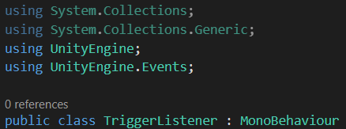

# Unity Tutorium
Dieses Projekt wurde im Rahmen eines Tutoriums an der Hochschule Furtwangen zur Einführung in Unity erstellt.

## 1 Szenen, Objekte und Komponenten
Eine Szene in Unity ist eine Menge von Objekten, die in einer Baumstruktur angeordnet sind. Wenn eine Szene erstellt wird, oder auch die <i>SampleScene</i> mit der ein Projekt beginnt, dann enthält diese bereits zwei Objekte. Jeweils eine <i>Main Camera</i> und ein <i>Directional Light</i>. Die Kamera nimmt das Bild im Spiel auf und das Licht simuliert die Sonne.

Wenn wir ein Objekt einer Szene hinzufügen wollen geht das über den <b>+</b>-Button vom <i>Hierarchy</i>-Fenster oder Rechtscklick in das Fenster hinein. Dann gibt es die Auswahl zwischen einem leerem Objekt und unterschiedlichen Kategorien von Objekten. Dreidimensionale Körper können in der Kategorie <i>3D Object</i> gefunden werden.

Objekte in einer Szene können untergeordnete Objekte haben, daher die Baumstruktur. Wenn wir einem Objekt ein untergeordnetes Objekt hinzufügen wollen, ist das über Rechtsklick auf das Objekt im <i>Hierarchy</i>-Fenster möglich oder wir ziehen per Drag-and-Drop ein bestehendes Objekt auf ein anderes. Wenn wir Objekte verschieben, drehen oder skalieren wollen, geht das entweder über die Werkzeuge im Szenenfenster oder über die Eigenschaften <i>Position</i>, <i>Rotation</i> und <i>Scale</i> in der <i>Transform</i>-Komponente eines Objekts. Wenn wir Objekten unterschiedliche Farben oder allgemein Oberflächen verpassen wollen, können wir im Projektfenster <i>Materials</i> erstellen und diese per Drag-and-Drop auf das jeweilige Objekt ziehen. Das erstellen von Materials oder anderen Assets im Projektfenster geht über den <b>+</b>-Button, oder indem wir in einem Ordner Rechtsklicken und auf <i>Create</i> gehen. Jetzt können wir zum Beispiel eine Szene mit Würfeln wie in der folgenden Abbildung aufbauen.

Diese Szene ist bis jetzt noch statisch. Selbst wenn wir im Unity-Editor auf den Play-Button drücken, passiert nichts. In Unity können Objekten über Komponenten Funktionalität hinzugefügt werden. Tatsächlich besitzen die Objekte in dieser Szene schon Komponenten. Die <i>Main Camera</i> hat die Komponenten <i>Camera</i> und <i>Audio Listener</i>, das <i>Direction Light</i> hat die Komponente <i>Light</i> und unsere Würfel haben die Komponenten <i>Mesh Filter</i>, <i>Mesh Renderer</i> und <i>Box Collider</i>. Außerdem hat jedes <i>GameObject</i> in Unity immer eine <i>Transform</i>-Komponente. Wenn wir eine Komponente hinzufügen wollen geht das mit dem <i>Add Component</i>-Button nach der letzten Komponente eines Objekts.

Wenn wir jetzt zum Beispiel den Boden drehen lassen wollen, können wir nach einer Komponente <i>RotationAnimator</i> suchen. So eine Komponente gibt es nicht Unity, aber wir haben die Möglichkeit über den Button <i>New script</i> ein neues C#-Skript zu erstellen und dieses direkt als Komponente dem Objekt hinzuzufügen. Wenn wir das gemacht haben, finden wir jetzt das Skript auch in dem Projektfenster unter dem Ordner <i>Assets</i>. Hier können wir auf gleiche weise wie <i>Materials</i> auch Ordner erstellen. So kann auch ein Ordner für die C#-Skripte erstellt werden um unser Projekt etwas organisierter zu halten. Mit Doppelklick auf das Skript im Projektfenster oder Klick auf die Pünktchen von der Komponente im <i>Inspector</i> und Auswahl von <i>Edit Script</i>, kann das Skript zur Bearbeitung geöffnet werden. Ein neues Skript sieht vorerst wie in der folgenden Abbildung aus.

Wir sehen hier eine Klasse mit dem Namen <i>RotationAnimator</i> wie wir angegeben haben und diese erbt von der Klasse <i>MonoBehaviour</i>, veranschaulicht durch den Doppelpunkt. Durch die Vererbung wird der Klasse alle Grundfunktionalitäten für Skripte in Unity gegeben. Zum Beispiel sind die Methoden <i>Start</i> und <i>Update</i> von MonoBehaviour geerbt. Wichtig zu verstehen ist hier aber erstmal nur wann die Methoden aufgerufen werden. Das steht praktischerweise am Anfang jeweils in der Kommentarzeile über der Methode. Kommentare können in C# mit <i>//</i> angeführt werden. Dadurch wird alles was dahintersteht bei der Ausführung ignoriert und dient somit nur als Information für den Entwickler. Um ein Objekt dauerhaft drehen zu lassen können wir von der <i>Transform</i>-Komponente die <i>Rotate</i>-Methode aufrufen, wie in der folgenden Abbildung zu sehen.

Dabei wird, wenn wir runde Klammer auf schreiben, eine Beschreibung der Methode dargestellt bei der wir auch die Parameter sehen. Parameter sind Variablen, die wir in den Runden Klammern an eine Methode übergeben können. In der Regel müssen alle erwarteten Parameter auch übergeben werden, jedoch gibt es sogenannte Überladungen von Methoden. Das sind andere implementierungen einer Methode mit mehr, weniger oder ganz anderen Parametern. So können wir hier auch nur den ersten Parameter <i>eulers</i> angeben. Hier wird ein Objekt des Typs <i>Vector3</i> erwartet. Ein solches Objekt können wir mit <i>new Vector3()</i> erzeugen. Wenn wir hier die Klammer öffnen und eine <i>0</i> schreiben, dann sehen wir die Beschreibung einer Konstruktorüberladung mit drei Parametern <i>x</i>, <i>y</i> und <i>z</i>. Ein Konstruktor ist eine Methode zur Erzeugung eines Objekts von dem entsprechenden Typ. Diese Variante können wir verwenden, um das Objekt zum Beispiel bei jedem <i>Update</i>-Aufruf um 5° um die y-Achse drehen zu lassen.

Wenn wir jetzt im Unity-Editor den Play-Button drücken, sehen wir wie sich der Boden mit unserer <i>RotationAnimator</i>-Komponente dreht. Wir sehen auch, dass sich die Würfel auf dem Boden mitrotieren. Das liegt daran, dass sie dem Boden untergeordnet wurden, sie also Kinder des Bodens sind. Dadurch wird die Transformation des Bodens auf die der Würfel übertragen, während die Würfel aber auch individuell relativ zum Boden transformiert sein können. Wir auch einem der Würfel die <i>RotationAnimator</i>-Komponente hinzufügen, dann sehen wir, wie sich der Würfel mit dem Boden rotiert und zusätzlich auf dem Boden rotiert. Jetzt besteht aber das Problem, dass die Geschwindigkeit der Drehung davon abhängt, wie Oft das Bild pro Sekunde aktualisiert wird. Um dieses Problem zu beheben können wir den Vektor, welchen wir an <i>transform.Rotate</i> übergeben, mit <i>Time.deltaTime</i> multiplizieren. <i>Time</i> ist eine Klasse die Unity liefert und die Eigenschaft <i>deltaTime</i> liefert immer die Zeit in Sekunden die vom letzten Frame bis zum Aktuellen vergangen ist. Wenn wir jetzt die Szene abspielen, dreht sich der Würfel langsamer, da die Zeit zwischen zwei Frames weniger als eine Sekunde beträgt. Wir könnten die Geschwindigkeit anpassen, indem wir bei dem Vektor anstatt eine <i>5</i> eine höhere Zahl eintragen, doch wenn die Geschwindigkeit auch noch in Zukunft angepasst wird, müssten wir das Skript jedes Mal neu übersetzen lassen. Beim Übersetzen wird der für uns leserliche Code zu für den Computer ausführbaren Code übersetzt. Dieser Prozess kann viel Zeit kosten, vor Allem wenn häufig neu übersetzt werden muss. Um das zu umgehen können wir der Komponente ein Feld geben, das wir auch im Unity-Editor bearbeiten können. Eine solches Feld kann im Skript mit dem Attribut <i>[SerializeField]</i> angeführt werden. Des Weiteren wird ein Datentyp erwartet. Wir wollen hier eine Geschwindigkeit als Feld definieren und dafür eignet sich eine Fließkommazahl, also geben wir <i>float</i> an. Dann wird nur noch ein Name für das Feld erwartet. Das Feld sollte dann wie folgt im Skript definiert sein.

Jetzt müssen wir nur noch den Vektor für die Drehung mit dem neuen Feld <i>speed</i> multiplizieren. Gehen wir zurück zum Unity-Editor sehen wir das Feld <i>speed</i> und wir sollten den Wert auf etwas anderes als 0 ändern, damit sich unser Boden dreht.

Wird jetzt die Szene abgespielt dreht sich unser Würfel mit konstanter Geschwindigkeit egal wie schnell die Frames vom Computer berechnet werden. Wir haben außerdem die Möglichkeit während die Szene abgespielt wird das Feld <i>speed</i> zu verändern und sehen direkt den Effekt, also wie sich der Würfel mit der neuen Geschwindigkeit dreht. Um nochmal zu dem Prinzip von untergeordneten Objekten zurückzukehren können wir jetzt auch dem Würfel, der relativ zum Boden rotiert, eine negative Geschwindigkeit geben, sodass dieser sich nicht mehr relativ zur Kamera dreht sondern nur noch verschiebt. Dann sollte der entsprechende Würfel immer richtung Kamera schauen, wie in der folgenden Abbildung zu sehen.

## 2 Physik und Prefabs

Wir haben ja schon gesehen, dass die Würfel, welche wir erstellt haben, <i>Box Collider</i> besitzen. Wir wissen aber noch nicht was sie tun. <i>Collider</i> im allgemeinen werden dazu verwendet zu erkennen, wann Objekte sich berühren. Das ist wichtig um für bewegliche Objekte Hindernisse schaffen zu können. Zum Beispiel wenn wir einen Spielercharakter implementieren wollen müssen wir wissen wann der Charakter anhalten muss, weil eine Wand im Weg ist. Aber auch wenn ein Flummi durch die Szene hüpfen soll sind <i>Collider</i> wichtig, damit der Flummi weiß, wann er abprallen soll. Bis jetzt bewegen sich aber nur die animierten Würfel in unserer Szene und nichts wird von einer Gravitation nach unten gezogen. Um einen frei beweglichen Körper, der an anderen Objekten abprallt, zu simulieren, wie einen Flummi, gibt es in Unity eine weitere Komponente, die <i>Rigidbody</i>-Komponente. Bevor wir aber die Szene verändern, machen wir erst eine Kopie mit <i>strg</i>+<i>d</i> oder <i>strg</i>+<i>c</i> und <i>strg</i>+<i>v</i>. Diese nennen wir dann <i>Szene 2</i> für das zweite Kapitel. In der Kopie können wir dann eine Kugel einfügen, die automatisch mit einem <i>Collider</i> einhergeht und dieser eine <i>Rigidbody</i>-Komponente hinzufügen. Wenn wir sie mit etwas Abstand über den Boden setzen und die Szene abspielen, sehen wir, wie die Kugel abprallt. Jetzt springt die Kugel aber noch nicht wie ein Flummi. Um das zu erreichen müssen wir ein <i>Physic Material</i> erstellen. Hierbei handelt es sich um ein Asset und somit können wir das im Projektfenster erstellen. Im <i>Physic Material</i> können wir die <i>Bounciness</i> als auch andere Eigenschaften einstellen. Dieser Wert geht von 0 bis 1, wenn uns das noch nicht reicht, können wir auch die Methode ändern, wie das Federlevel der beiden kombiniert wird. Das neue Material müssen wir dann beim <i>Collider</i> auswählen. Unsere Kugel kann dann wie folgt konfiguriert sein.

Was uns jetzt vielleicht noch auffällt ist die Checkbox für <i>Is Trigger</i> beim <i>Collider</i>. Wenn wir dieses Feld aktivieren, dann wird das Objekt nicht mehr als solides Objekt behandelt sondern als ein begehbarer Raum, welcher aber auf <i>Collider</i> reagiert, die in den Raum rein oder raus gehen. Wir können Mal einen neuen Würfel erstellen bei den wir den <i>Collider</i> zu einem <i>Trigger</i> umschalten. Um zu veranschaulichen, dass der Würfel begehbar ist, erstellen wir ein neues transparentes Material, das wir dem Würfel geben. Wenn jetzt also unser Flummi in den Trigger fliegt, wird er ausgelöst, jedoch haben wir noch nicht implementiert, was in so einem Fall passieren soll. Dafür erstellen wir eine neue Komponente, die wir <i>TriggerListener</i> nennen. Dort wollen wir nicht mehr auf die Ereignisse <i>Start</i> und <i>Update</i> reagieren, also können wir diese Methoden entfernen. Stattdessen fügen wir zwei andere Methoden ein, nämlich <i>OnTriggerEnter</i> und <i>OnTriggerExit</i>. Damit wir ein Feedback bekommen, wenn diese Ereignisse eintreten können wir Debug-Ausgaben einfügen. Das geschieht mit der <i>Log</i>-Methode der von Unity gelieferten Debug-Klasse. Die folgende Abbildung zeigt wie diese Ausgaben aussehen können.

Wenn wir jetzt die Szene starten und den Flummi in den <i>Trigger</i> fliegen lassen, sehen wir im Fenster der Konsole, dass Ausgaben erfolgen.

Jetzt haben wir eine Ausgabe, wenn der <i>Trigger</i> ausgelöst wird aber sonst passiert aktuell noch nichts. Wenn wir wollen das ein Objekt verschwindet oder ein Feuerwerk ausgelöst wird, wenn sich ein Objekt in den <i>Trigger</i> hineinbewegt, dann könnten wir das fest als Teil der <i>TriggerListener</i>-Komponente implementieren. Alternativ haben wir aber auch die Möglichkeit einen <i>TriggerListener</i> zu implementieren bei dem erst im Unity-Editor festgelegt wird was beim Eintreten von <i>TriggerEnter</i> und <i>TriggerExit</i> geschehen soll. Hier kommen <i>UnityEvents</i> ins Spiel. <i>UnityEvents</i> können als Felder angelegt werden und werden im Editor sichtbar wie wir es schon mit der Geschwindigkeit vom <i>RotationAnimator</i> gemacht haben. Hierbei wird aber keine Fließkommazahl definiert, sondern eine Liste von Methoden festgelegt, die ausgeführt werden sollen, wenn das jeweilige Ereignis eintritt. Um <i>UnityEvents</i> zu verwenden müssen wir den Namensraum <i>UnityEngine.Events</i>, in dem sie implementiert sind, bekannt machen. Das geht mit dem <i>using</i>-Schlüsselwort wie in der folgenden Abbildung zu sehen.

Dann fügen wir dem Skript zwei neue Felder <i>TriggerEnterResponse</i> und <i>TriggerExitResponse</i> vom Typ <i>UnityEvent</i> hinzu. Diese können wir dann in den Entsprechenden Methoden, die bis jetzt nur eine Debug-Ausgabe enthalten, auslösen, indem wir jeweils deren <i>Invoke</i>-Methode aufrufen. Das sollte dann wie folgt aussehen.

Im Unity-Editor können wir jetzt Methoden auswählen die als Antwort auf die Ereignisse ausgeführt werden sollen. Dazu drücken wir den <b>+</b>-Button des jeweiligen Ereignises um einen neuen Eintrag hinzuzufügen. Dort wird als erstes ein Objekt verlangt, von dem wir die Methode ausführen wollen. Zum Testen können wir zum Beispiel die Farbe des Triggers ändern lassen. Dazu ziehen wir per Drag-and-Drop den Trigger selbst als Objekt in den Eintrag und wählen als Methode vom <i>MeshRenderer</i> die Eigenschaft <i>material</i> aus. Hier können wir jetzt noch einen Wert einstellen auf den dann diese Eigenschaft gesetzt werden soll und dazu brauchen wir erst ein neues <i>Material</i>. Wir kopieren das <i>Material</i> des Triggers und ändern dessen Farbe um dann diese Kopie als Wert zu setzen auf den die Eigenschaft <i>material</i> gesetzt werden soll beim Eintreten von <i>TriggerEnter</i>. Bei <i>TriggerExit</i> können wir diese Eigenschaft wieder auf das ursprüngliche Material setzen.

Wenn jetzt die Szene abgespielt wird sollte sich die Farbe des Triggers ändern, wenn der Flummi reinfliegt und sich wieder zurücksetzen, wenn er rausfliegt. Im Laufe dieses Kapitels haben wir jetzt zwei neue Arten von Objekte erstellt. Zum einen einen Flummi und eine Trigger-Box. Im letzten Kapitel haben wir außerdem drehende Körper erstellt. Aus all diesen Objekten können wir jetzt Prefabs erzeugen. Dazu können wir diese Objekte in der Szene auswählen und per Drag-and-Drop in das Projektfenster ziehen. Wenn wir jetzt kopien dieser Objekte in einer Szene benötigen können wir dessen Prefabs, die jetzt im Projektordner sichtbar sein sollten, genauso per Drag-and-Drop in die entsprechende Szene ziehen. Der Vorteil den wir jetzt haben ist, dass wir nur noch an einer Stelle, innerhalb des jeweiligen Prefabs, Änderungen vornehmen müssen, wenn wir zum Beispiel das Verhalten des Flummis für alle Kopien in allen Szenen verändern wollen. Jetzt brauchen wir nur noch einen Ordner für die Prefabs. Dorthin kann auch das <i>Physic Material</i> des Flummis verschoben werden.

## 3 Inputs und Character Movement

Unsere Szene ist mit den neuen Physikobjekten definitiv nicht mehr statisch, doch können wir immer noch nicht mit der Anwendung interagieren. Um Interaktionen zu ermöglichen müssen wir auf <i>Inputs</i> (Eingaben) reagieren. Diese können von verschiedenen Geräten erfolgen z. B. Tastatur, Gamepad oder Android. Hier verwenden wir das neue Input-System von Unity. Das können wir dem Projekt über <i>Window/Package Manager</i> hinzufügen. Der <i>Package Manager</i> spielt in Unity eine wichtige Rolle, da hier viele erweiternde Pakete für das Projekt hinzugefügt werden können. Viele, wie auch das <i>Input System</i>, können schon im Unity Registry gefunden werden. Es gibt aber auch unter <i>Window/Asset Store</i> einen Shop auf dem noch weitere Pakete, darunter auch Levels, 3D-Modelle, Effekte etc., gefunden werden können.

Im <i>Unity Registry</i> kann über das Suchfeld nach dem Paket <i>Input System</i> gesucht werden und über den Button <i>instal</i> installiert werden. Danach können wir im Projektordner neue <i>Input Actions</i> erstellen, die wir <i>Player Actions</i> nennen.

Öffnen wir diese sollten wir folgendes Fenster sehen.
 

 
Mit dem <b>+</i>-Button fügen wir eine neue <i>Action</i> Map hinzu, die wir <i>Default Actions</i> nennen. Dann fügen wir eine Aktion <i>Look</i> hinzu. Diese Aktion werden wir nutzen, um die Kamera zu schwenken. Das wollen wir über die Bewegung der Maus ermöglichen. Als <i>Action Type</i> wählen wir <i>Value</i> und als <i>Controll Type</i> <i>Vector 2</i>, da wir die Änderung der Position der Maus auslesen wollen (in x- und y-Richtung). Wenn wir <i>Look</i> aufklappen, sehen wir dessen <i>Binding</i>. Hier wählen wir als <i>Path</i> <i>Mouse/Delta</i> aus. Damit haben wir die erste Aktion definiert und können jetzt ein C#-Skript erstellen, das auf diese Aktion reagiert. Um auf eine Input-Aktion zu reagieren, kann eine Methode definiert werden mit einem Parameter <i>context</i> vom Typ <i>InputAction.CallbackContext</i> aus dem Namensraum <i>UnityEngine.InputSystem</i>. Hierfür erstellen wir eine Methode <i>OnInput</i>. Aus dem Parameter <i>context</i> können wir mit der Methode <i>ReadValue</i> den Wert des Inputs auslesen. Dabei müssen wir den Datentyp angeben. Hier geben wir <i>Vector2</i> an, wie wir es bei der Aktion angegeben haben. Der Wert kann schließlich in einem Feld <i>input</i> gespeichert werden.

Jetzt können wir mit <i>transform.Rotate</i> unser Objekt, das die Kamera sein wird, rotieren. Als x-Rotation geben wir <i>input.y</i> und als y-Rotation <i>input.x</i> an. Gehen wir in den Unity-Editor zurück können wir das <i>Look</i>-Skript der Kamera hinzufügen. Noch wird aber die Methode <i>OnInput</i> nicht aufgerufen. Um das zu ändern braucht es noch die Komponente <i>Player Input</i>. Hier können wir unter <i>Behavior</i> <i>Invoke Unity Events</i> auswählen. Dann erscheinen die Ereignisse darunter und können aufgeklappt werden. Unter <i>Default Actions</i> finden wir unsere <i>Look</i>-Aktion und können dem Ereignis einen Methodenaufruf hinzufügen. Von der Kamera kann dann von der Look-Komponente <i>OnInput</i> ausgewählt werden. Da diese Methode einen Parameter vom Typ <i>CallbackContext</i> enthält erscheint sie jetzt ganz oben in der Auswahl. Starten wir die Szene jetzt, können wir die Maus bewegen und sollten sehen wie sich die Kamera entsprechend dreht.

Nachdem wir die Kamera drehen können, wollen wir uns vielleicht auch bewegen können. Dafür gibt es in Unity die Komponente <i>Character Controller</i>. Diese berücksichtigt die Kollision mit anderen Objekten und beinhaltet selbst einen <i>Collider</i>, sodass sich das jeweilige Objekt nicht durch andere Objekte bewegen kann. Der Kamera geben wir ein Elternobjekt das wir <i>Player Character</i> nennen und diesem fügen wir die Komponente hinzu. Jetzt können wir die Kamera bewegen, indem wir die <i>Move</i>-Methode der <i>Character Controller</i>-Komponente aufrufen. Dazu erstellen wir ein neues Skript <i>Move</i> hier fügen wir eine Methode <i>OnInput</i> ein, wie wir sie auch für <i>Look</i> implementiert haben. Dann wollen wir in <i>Update</i> vom <i>Character Controller Move</i> aufrufen. Dazu benötigen wir ein Feld <i>controller</i> vom Typ <i>Character Controller</i>. Die <i>Move</i>-Methode erwartet ein <i>Vector3 motion</i>. Hier erzeugen wir einen neuen Vektor mit <i>input.x</i> als Bewegung in x-Richtung und <i>input.y</i> als Bewegung in y-Richtung. Jetzt muss nur noch wieder die Methode <i>OnInput</i> aufgerufen werden. Dazu definieren wir unter <i>Player Actions</i> eine neue Aktion <i>Move</i>. <i>Action Type</i> und <i>Control Type</i> bleibt gleich wie bei <i>Look</i>. Das <i>Binding</i> entfernen wir aber um ein neues hinzuzufügen. Hier wollen wir <i>Add Up/Down/Left/Right Composite</i> auswählen. Das <i>Binding</i> können wir <i>WASD</i> nennen. Dann müssen wir den vier Richtungen Inputs zuweisen. Dazu klicken wir bei Path auf <i>Listen</i> und drücken dann die gewünschte Taste. Haben wir das gemacht, lässt sich bei der <i>Player Input</i>-Komponente unter <i>Events/Default Actions</i> unsere neue <i>Move</i>-Aktion finden. Hier rufen wir <i>OnInput</i> auf von der <i>Move</i>-Komponente vom <i>Player Character</i>. Spielen wir die Szene ab, können wir uns jetzt auch bewegen, doch wir bewegen uns nicht in die Richtung in die wir schauen. Um dieses Problem zu beheben brauchen wir ein neues Feld im <i>Move</i>-Skript, welches die Transformation der Kamera speichert. Dieses Feld nennen wir <i>lookTarget</i>. Jetzt können wir die Blickrichtung mit <i>lookTarget.forward</i> auslesen und mit <i>lookTarget.right</i> erhalten wir was für die Kamera rechts ist. Die Bewegung können wir jetzt also wie folgt berechnen.

Jetzt können wir uns durch die Szene bewegen, aber wir haben noch keine Interaktionsmöglichkeit außer die Triggerboxen. Wenn wir versuchen uns gegen unseren Flummi zu bewegen, dann halten wir vor ihm an. Das liegt daran, dass die <i>Character Controller</i>-Komponente nicht von sich aus <i>Rigidbodies</i> schiebt. Wenn wir diese Funktionalität haben wollen brauchen wir wieder ein neues Skript. Dieses nennen wir <i>Push</i>. Im Skript können die Methode <i>OnControllerColliderHit</i> einfügen. Diese wird aufgerufen, wenn der <i>Character Controller</i> ein Objekt berührt. Dann können wir vom Parameter <i>hit.collider.attachedRigidbody</i> aufrufen um die <i>Rigidbody</i>-Komponente des berührten Objekts zu erhalten. Jetzt sollten wir noch prüfen, ob diese Komponente überhaupt existiert und ob der Körper auch nicht kinematisch ist. Abfragen lassen sich wie folgt schreiben.

Wenn kein <i>Rigidbody</i> existiert oder der Körper Kinematisch ist, soll die Methode abgebrochen werden. Dafür wird hier die <i>return</i>-Anweisung verwendet. Um jetzt den Körper zu schieben rufen wir <i>AddForce</i> auf. Mit <i>hit.moveDirection</i> erhalten wir die Richtung, in die sich der <i>Character Controller</i> bewegt und somit auch die Richtung in die wir die Kraft anwenden wollen. Jetzt brauchen wir die Richtung nur noch mit einer stärke multiplizieren und wir haben unseren Kraftvektor. Als <i>ForceMode</i> wollen wir <i>Impulse</i> angeben. Fügen wir diese Komponente dem <i>Player Character</i> hinzu und testen nochmal die Szene, sollten wir in der Lage sein den Flummi zu bewegen.

## 4 Scriptable Objects

Wenn wir für Unity eigene Typen von Assets definieren wollen, dann geht das mit <i>Scriptable Objects</i>. Eine Anwendung dafür ist z. B. ein Fließkommawert, der in einem Asset gespeichert ist. Damit könnten wir für unsere erste Szene dafür sorgen, dass wir die Drehgeschwindigkeit nur an einer Stelle ändern müssen, obwohl wir mehrere Würfel mit <i>Rotation Animator</i>-Komponenten drehen lassen. Ein <i>Scriptable Objects</i> erstellen wir in Unity über ein C#-Skript. Hier müssen wir den Typ <i>MonoBehavior</i> auf <i>ScriptableObject</i> ändern, von dem wir erben. In der Klasse wollen wir einfach nur ein Feld <i>value</i> definieren. Um auf den Wert auch von außen zugreifen zu können definieren wir noch eine Eigenschaft mit dem gleichen Namen. Eigenschaften verhalten sich wie Felder in C# und fassen eine Lese- und Schreibmethode zusammen. So können wir mithilfe einer Eigenschaft eine öffentliche Lesemethode für unser nicht-öffentliches Feld definieren. Das sieht dann wie folgt aus.

Damit die Klasse fast fertig. Was noch fehlt ist das Attribut <i>[CreateAssetMenu]</i> vor unserer Klassendefinition. Dadurch wird bei dem <i>Create Asset</i>-Fenster ein Eintrag für unser <i>ScriptableObject</i> gemacht. Wir können jetzt also im Projektordner ein <i>FloatValue</i> erstellen. Diesen nennen wir <i>Rotate Speed</i>. Noch haben wir aber keine Möglichkeit dieses Objekt als Wert von der Geschwindigkeit eines <i>RotationAnimators</i> zu setzen. Dazu müssen wir eine kleine Änderung im Skript machen. Anstatt eine Geschwindigkeit vom Typ <i>float</i> soll es jetzt den Typ <i>FloatValue</i> erwarten. Gehen wir in den Unity-Editor zurück können wir jetzt unser <i>Rotate Speed</i> in das Geschwindigkeitsfeld des <i>RotationAnimators</i> einfügen. Spielen wir die Szene jetzt ab und ändern den Wert von <i>Rotate Speed</i> aktualisiert sich die Geschwindigkeit der Würfel und es drehen sich immer alle gleich schnell. Eine weitere Anwendung sind Ereignisse, die nicht nur innerhalb einer Szene oder eines Prefabs bekannt sein sollen, sondern als Asset im ganzen Projekt. So können wir mehrere Prefabs erstellen, die das gleiche Ereignis auslösen und Prefabs, die auf das gleiche Ereignis reagieren. Hierfür sind zwei Klassen nötig. Einmal ein <i>ScriptableObject Event</i> und ein <i>MonoBehavior EventListener</i>. Für die Implementierung unseres eigenen Events brauchen wir erst einen Methodentyp, den wir in einer Liste speichern und aufrufen können. Um einen Methodentyp zu deklarieren gibt es in C# das Schlüsselwort <i>delegate</i>. Dann schreiben wir wie gewohnt einen Rückgabewert, Namen und die Parameter. Abgeschlossen wird der Typ dann mit einem Semikolon anstatt die Methode mit geschweiften Klammern zu öffnen. Darunter definieren wir ein Feld mit dem Typ <i>List<EventDelegate></i> das direkt initialisiert wird.

Um sich beim Ereignis registrieren zu können fügen wir eine Methode <i>AddListener</i> hinzu. Diese erwartet ein <i>EventDelegate</i>. Bevor wir den <i>Listener</i> unserer Liste hinzufügen, prüfen wir, ob es schon enthalten ist, um zu verhindern, dass <i>Listener</i> doppelt in der Liste vorhanden sind. Elemente können mit der <i>Add</i>-Methode in eine Liste eingefügt werden. Zusätzlich können wir noch eine <i>RemoveListener</i>-Methode schreiben. Um das Ereignis auch auslösen zu können braucht es noch eine <i>Invoke</i>-Methode. Hier wird jeder <i>Listener</i> aufgerufen. Wir können alle Elemente einer Liste mit einer <i>foreach</i>-Schleife durchlaufen. Dabei schreiben wir <i>foreach</i>, runde Klammer auf, die Variable in der immer ein Element der Liste zwischengespeichert werden soll, <i>in</i> und die Liste die wir durchlaufen wollen. Die Klasse sieht dann wie folgt aus.

Beim <i>EventListener</i> benötigen wir ein Feld mit dem Ereignis, auf das reagiert werden soll und ein <i>UnityEvent response</i> als Antwort auf das Ereignis. Dadurch wird wie beim <i>TriggerListener</i> nicht im Skirpt selbst definiert was beim Eintritt des Ereignisses passieren soll, sondern erst im Unity-Editor. Jetzt muss sich der <i>Listener</i> nur beim Ereignis registrieren. Das machen wir bei <i>OnEnable</i>. Diese Methode wird aufgerufen, wenn die Komponente aktiviert wird. Genauso entfernen wir unserere registrierung bei <i>OnDisable</i>. Als <i>EventDelegate</i> können wir dann <i>response.Invoke</i> angeben.

Zum Testen können wir unser <i>Trigger</i>-Prefab klonen und diesen <i>Trigger Door</i> nennen. Dann erstellen wir ein Ereignis <i>Door Open</i>. Auf <i>Trigger Enter</i> soll jetzt das Ereignis ausgelöst werden. Danach erstellen wir ein neues Prefab mit einem Würfel, das wir <i>Door</i> nennen. Dieses Prefab soll auch einen <i>EventListener</i> bekommen, welcher auf <i>Door Open</i> hört. Als Antwort soll der <i>Collider</i> und <i>Mesh Renderer</i> deaktiviert werden, sodass die Tür bzw. der Würfel verschwindet. Wenn wir beide Prefabs in eine Szene ziehen und sie starten, sollte die Tür verschwinden, wenn der Trigger von uns ausgelöst wird. Jetzt können wir noch weitere <i>Trigger Door</i>-Objekte und weitere Türen einfügen. Dadurch haben wir jetzt mehre <i>Trigger</i> zur Auswahl, über die sich automatisch alle Türen öffnen, ohne dass wir dafür jeden <i>Trigger</i> einzeln konfigurieren mussten.

## 5 Visual Effect Graph

Jetzt haben wir neue Ereignisse eingefügt, die sich über unsere Trigger aufrufen lassen. Jetzt könnten wir auch auf die Idee kommen ein Feuerwerk auf ein Ereignis starten zu lassen. Für solche Effekte eignet sich der <i>Visual Effect Graph</i> von Unity. Das ist ein Paket im <i>Unity Registry</i>, mit dem sich Partikeleffekte in einem Graphen visuell programmieren lassen. Um das Paket zu nutzen braucht es aber entweder die <i>Universal-</i> oder die </i>High Definition Render Pipeline</i>. Hier verwenden wir die </i>High Definition RP</i>, welche mächtiger ist als die </i>Universal RP</i>, dafür aber weniger, nur leistungsfähigere Geräte unterstützt. Wir verwenden außerdem die <i>Experimental Operators/Blocks</i>, welche unter <i>Edit/Preferences/Visual Effects</i> aktiviert werden können. Wenn wir beide Pakete installiert haben, können wir im Projektordner ein <i>Visual Effect Graph</i> unter dem Eintrag <i>Visual Effects</i> erstellen. Öffnen wir diesen sehen wir folgendes Fenster.

In einem <i>Visual Effect Graph</i> wird ein Partikelsystem definiert. Ein Partikelsystem verwaltet mehrere Partikel und ist in der Lage diese gleichzeitig zu bewegen und animieren, wobei Partikel einfache Objekte sind, die in der Regel über ein 2D-Bild oder ein 3D-Körper dargestellt werden. Damit können verschiedene visuelle Effekte wie Feuer, Nebel, Explusionen etc. umgesetzt werden. Ein <i>Visual Effect Graph</i> startet mit vier Komponenten. <i>Spawn, Initialize Particle, Update Particle</i> und <i>Output Particel Quad</i>. Dabei verhalten sich <i>Initialize</i> und <i>Update</i> wie <i>Start</i> und <i>Update</i> von <i>MonoBehavior</i> pro Partikel. In <i>Spawn</i> wird definiert, wann wie viele Partikel erzeugt werden. In <i>Output</i> wird festgelegt wie ein Partikel dargestellt wird. Hier können wir die Textur von <i>DefaultParticle</i> zu <i>Default-Particle</i> ändern. Damit haben wir einen weißen Kreis, der nach außen hin transparent wird. Außerdem wollen wir <i>Blend Mode</i> auf <i>Additive</i> setzen. Bei <i>Set Color over Life</i> lässt sich der Farbverlauf für die Partikel einstellen. Bei einem Gradienten wird oben die Transparenz und unten die Farbe festgelegt. So kann der Farbverlauf z. B. wie folgt festgelegt werden.

Bei Spawn wollen wir anstatt kontinuierlich, auf einen Schlag mehrere Partikel erzeugen. Dafür entfernen wir den aktuellen Block und fügen als neuen Block, <i>Single Burst</i> ein. Bei dem Feld <i>Count</i> können wir dann die Anzahl festlegen. Wichtig ist hierbei, dass nie mehr Partikel, als in <i>Capacity</i> von <i>Initialize Particle</i> definiert ist, gleichzeitig existieren können. Es empfiehlt sich eine Kapazität höher als die <i>Spawn</i>-Anzahl festzulegen, damit das Feuerwerk mehrmals abgespielt werden kann, auch wenn die vorherigen Partikel noch nicht verschwunden sind.

Um den Effekt in eine Szene einzufügen, können wir ihn per Drag-and-Drop reinziehen. Haben wir den <i>Visual Effect</i> ausgewählt, erscheint ein Fenster mit dem wir den Effekt steuern können. Hier können wir ihn stoppen, pausieren/abspielen, schrittweise abspielen und neu starten. Mit <i>Rate</i> lässt sich die Abspielrate oder auch -geschwindigkeit festlegen. Wenn wir auf <i>Play()</i> oder neu starten klicken, dann sehen wir unseren Partikeleffekt in Aktion. Noch sieht nicht zu sehr nach einem Feuerwerk aus. Wir wollen, dass die Partikel eine Kugel bilden. Dazu müssen wir <i>Set Velocity Random</i> gegen <i>Set Velocity from Direction & Speed</i> tauschen. Wir können einen Block entfernen, indem wir ihn anklicken und <i>Entf</i> drücken. Hinzufügen können wir einen Block, indem wir bei einem Kontext, wie <i>Update</i> rechtsklicken. Dann sollen die Partikel in der Luft abbremsen und von Schwerkraft beeinflusst werden. Hierfür fügen wir bei Update <i>Linear Drag</i> und <i>Gravity</i> ein. Abschließend können wir noch <i>Set Size over Life</i> mit <i>Set Size Random</i> ersetzen. Dadurch haben wir keine Größenänderung sondern unterschiedliche Größen unter den Partikeln. Wenn wir jetzt den Effekt abspielen und etwas die Werte anpassen, sieht unser Feuerwerk schon besser aus.

## 6 Post Processing

Post Processing ermöglicht das geränderte Bild der Kamera nochmal nachzubereiten. Hier werden Effekte wie <i>Tonemapping, Bloom</i> und <i>Motion Blur</i> angewandt. Mit der <i>High Definition RP</i> wird standardmäßig Post Processing betrieben. Die Einstellungen dafür finden wir unter <i>Assets/HDRPDefaultResources/DefaultSettingsVolumeProfile</i>, solange wir sie von Unity haben erzeugen lassen. Das sind die Einstellungen, die die Pipeline nutzt solange kein <i>Volume</i> die Kamera beeinflusst. Wenn wir jetzt für eine Szene andere Einstellungen nutzen wollen, können wir ein <i>Global Volume</i> einfügen. Es gibt auch <i>Volumes</i>, die nicht global sind. Diese haben nur einen Effekt, wenn sich die Kamera in deren Bereich befindet. Dadurch kann die Atmosphäre von Ort zu Ort gewächselt werden. Unser Volume hat noch kein Profil. Mit dem <i>new</i>-Button lässt sich ein neues erstellen. Um jetzt unser Feuerwerk mehr herausstechen zu lassen können ein <i>Bloom</i>-Effekt hinzufügen. Mit <i>Add Override</i> lassen sich Effekte einfügen, die die Standardeffekte überschreiben. Bei dem <i>Bloom</i>-Effekt können wir die <i>intensity</i> auf 0.7 stellen. Dadurch leuchtet alles viel zu stark, sodass das Bild verwaschen wirkt. Um dieses Problem zu beheben können wir einen <i>threshold</i> von 0.9 einstellen. Dadurch wirkt der <i>Bloom</i>-Effekt erst bei einer Intensität (Helligkeit) größer als 0.9. Wenn wir jetzt unser Feuerwerk abspielen, leuchten die Partikel stärker. Wir können noch weitere Effekte einfügen wie z. B. Nebel, doch die meisten Effekte sind schon standardmäßig aktiviert, nur wenn wir sie individuell anpassen wollen können wir sie hier auch einfügen, wie wir es mit dem <i>Bloom</i>Effekt gemacht haben.

## 7 GPU Events und Nodes in VFX-Graph
GPU-Ereignisse werden in <i>Visual Effect Graph</i> dazu verwendet, um in <i>Initialize</i> oder <i>Update</i> neue Partikel eines anderen Systems zu erzeugen. Dieses Feature können wir ausnutzen, um unser Feuwerkseffekt weiter zu verbessern, sodass zuerst Raketen gefeuert werden, die erst beim Verschwinden unsere bisherige Explusion auslösen. Dazu kopieren wir vorerst unseren bisherigen Effekt. In der Kopie benennen wir zuerst das aktuelle System um, von <i>System</i> in <i>Explosion</i>. Dann trennen wir die Verbindung zum <i>Spawn</i>-Kontext, indem wir sie anklicken und <i>Entf</i> drücken. An das Event können wir dann einen neuen <i>Initialize</i>-Kontext anknüpfen, indem wir auf den Ausgang <i>SpawnEvent</i> klicken, gedrückthalten und in einem leeren Bereich loslassen. Für die Raketen wollen wir zuerst eine Geschwindigkeit setzen, damit sie nach oben fliegen. Diese darf auch eine zufällige Neigung in x- und z-Richtung haben. Dann wollen wir eine Lebensdauer setzen. Damit die Raketen zu unterschiedlichen Zeitpunkten explodieren, setzen wir eine zufällige Lebensdauer. Dann fügen wir ein <i>Update</i>-Kontext hinzu, genauso wie wir es für <i>Initialize</i> gemacht haben. Hier wollen wir vorerst nur Schwerkraft hinzufügen, um eine Parabelförmige Flugbahn zu erhalten. Dann fehlt nur noch der <i>Output</i>-Kontext. Diesen können wir komplett von unserer Explusion kopieren. Wenn wir den Effekt jetzt abspielen, sollten wir leuchtende Punkte sehen, die nach oben schießen. Bevor wir jetzt die Explusionen auslösen, sollten wir die Anzahl beim <i>SingleBurst</i>-Block anpassen, damit nur wenige Rakten geschossen werden. Und wir können das System der Raketen noch umbenennen. Jetzt können wir bei <i>Update</i> den Block <i>Trigger Event on Die</i> einfügen. Dieser Block hat einen Ausgang<i>evt</i>, an den wir ein <i>GPUEvent</i>-Kontext anknüpfen können. Das <i>SpawnEvent</i> kann dann mit <i>Initialize</i> von unserer Explusion verbunden werden. Bevor wir den Effekt erneut abspielen, wollen wir noch die  Anzahl bei <i>Trigger Event On Die</i> erhöhen. Jetzt sehen wir wie die Explusionen nach verschwinden der Raketen beginnen, doch sie starten alle am Ursprung des Effekts. Um dieses Problem zu beheben müsssen wir  in <i>Intiialize</i> den Block <i>Inherit Source Position</i> einfügen.  Es lassen sich auch andere Eigenschaften vom <i>Source</i>-Partikel erben, wobei sich <i>Source</i> immer auf den Partikel bezieht, der das <i>GPU</i>-Ereignis ausgelöst hat.

Betrachten wir unser Feuerwerk, fällt uns auf, dass alle Explusionen die gleiche Farbe haben. Wenn wir Feuerwerke unterschiedlicher Farbe haben wollen, können wir eine Eigenschaft beim <i>Blackboard</i> des Feuerwerkeffekts hinzufügen. Als Typ nehmen wir <i>Gradient</i>, da sich ja die Farbe unserer Partikel über die Lebensdauer ändert. Diese Eigenschaft können wir per Drag-and-Drop in den Graph ziehen und mit dem Eingang <i>Color</i> unserer Explusion verbinden. Wenn wir jetzt den Effekt in der Szene kopieren, können wir für die Kopie einen anderen Gradienten definieren und somit haben wir zwei Feuerwerke mit unterschiedlicher Farbe.

In <i>Visual Effect Graph</i> von Unity gibt es aber nicht nur Kontexte und Blöcke, es gibt auch Knoten und daher kommt auch die Bezeichnung Graph. Knoten können hier Werte oder Operationen sein. Das heißt wir können mit Knoten auch Logiken programmieren, nur halt visuell. Zum Testen können wir eine neue Szene erstellen, in der wir ein neuen visuellen Effekt einfügen. Bevor wir den Effekt bearbeiten stellen wir noch die Kamera ein, sodass wir ihn im <i>Game</i>-Fenster gut sehen können. Hier nehmen wir Mal <i>(2, 2, -4)</i> als Position. Dann öffnen wir den Graphen des Effekts und entfernen dort <i>Set Velocity</i> und <i>Set Size over Life</i>. Wir wollen jetzt anstatt die Blöcke für die Bewegung zu verwenden, die Flugbahn der Partikel über eine Funktion beschreiben, die wir mit den Knoten im <i>Visual Effect Graph</i> zusammensetzen können. Wir müssen aber die Position regelmäßig aktualisieren, weshalb wir den <i>Set Position</i>-Block in <i>Update</i> einfügen. Dann klappen wir den Eingang <i>Position</i> aus und verbinden <i>X</i> und <i>Y</i> mit dem Knoten <i>Age Over Lifetime</i>. Einen Knoten können wir mit rechtsklick auf einen Leeren Bereich und Auswahl von <i>Create Node</i> erstellen. Mit der Änderung sollten wir im <i>Game</i>-Fenster die Partikel fliegen sehen, mit einer diagonalen Flugbahn. Jetzt wollen wir vorerst den Wertebereich vergrößern, also Multiplizieren wir das Alter mit vier über den Knoten <i>Multiply</i> und verbinden das Ergebnis neu mit <i>X</i> und <i>Y</i>. Wieder sehen wir die Änderung im <i>Game</i>-Fenster. Danach subtrahieren wir zwei in verbinden diesmal nur <i>Y</i> neu. Jetzt starten die Partikel von weiter unten und erscheinen erst ab der Hälfte ihrer Flugbahn im Bild. Dann ziehen wir das Quadrat, indem wir das Ergebnis der Subtraktion mit sich selbst multiplizieren und schon sehen wir einen parabelförmigen Verlauf der Partikel. Wenn wir die Partikel erst hoch und dann runterfliegen lassen wollen, brauchen wir nur den Wert für <i>Y</i> negieren. Dafür gibt es sogar einen Knoten <i>Negate</i>. Doch jetzt sehen wir die Partikel nur an der Spitze des Parabelbogens. Um das zu beheben können wir einfach vier addieren und wir sehen wieder die komplette Flugbahn der Partikel.

## 8 Shader Graph

Ein weiteres Werkzeug bei dem auch visuel programmiert wird ist <i>Shader Graph</i>. <i>Shader</i> im allgemeinen sind Programme die zur Berechnung der Darstellung verschiedener Objekte verwendet werden. Der große Unterschied ist, dass diese Programme auf dem Grafik Prozessor laufen, welcher viel mehr Kerne besitzt als ein normaler Prozessor, die dafür aber weniger Leistung haben. Daher werden <i>Shader</i> möglichst einfach gehalten. Durch die Vielzahl an Kerne lassen sich mit einem <i>Shader</i> mehrere Punkte von Meshes oder mehre Pixel gleichzeitig verarbeiten. Der <i>Visual Effect Graph</i> nutzt auch die GPU, um mehrere Partikel parallel manipulieren zu können. Daher heißen die Ereignisse, die von einem Partikel aus gesendet werden können <i>GPU</i>-Ereignis. Ein <i>Shader</i>, wie wir ihn mit <i>Shader Graph</i> entwickeln können, nimmt ein Mesh entgegen, berechnet dessen Flächen und bietet die Möglichkeit einzelne Punkte davon zu manipulieren und berechnet darauf die Farbe einzelner Pixel der Flächen. Wir können also Form und Farbe der Oberfläche verändern. Als Übung wollen wir versuchen einen animierten Blitz auf der Oberfläche zeichnen zu lassen. Dazu könnten wir von Hand eine entsprechende Animation zeichnen, doch <i>Shader Graph</i> bietet verschiede <i>Noise</i>-Knoten, mit denen wir Blitze auch prozedural erzeugen können. Wir wollen aber den <i>Shader</i> später für einen Partikeleffekt nutzen, weshalb wir einen <i>VFX Shader Graph</i> erstellen. Öffnen wir den Graph sehen wir folgendes Fenster.

Einiges funktioniert hier ähnlich wie in <i>VFX Graph</i>, z. B. können wir auch mit rechtsklick Knoten erstellen. Als erstes wollen wir einen <i>Simple Noise</i>-Knoten einfügen. Hier haben wir einen Eingang <i>UV</i>, der einen 2D-Vektor erwartet für die Position im <i>Noise</i>-Feld. Jeder Knoten in <i>Shader Graph</i> besitzt eine Vorschau. Dabei steht </i>UV0</i> für einen Wertebereich von <i>(0, 0)</i> bis <i>(1, 1)</i>. Das <i>Noise</i>-Feld können wir über den zweiten Eingang skalieren und der Ausgang liefert dann die Helligkeit an der gegeben Position. Wenn wir den Ausgang jetzt mit <i>Base Color</i> verbinden, wird das <i>Noise</i>-Feld auf die Oberfläche gezeichnet. Um einen Blitz nachzubilden, brauchen wir erstmal eine gerade Linie, die wir dann mit dem <i>Noise</i>-Wert verzerren können. Eine Linie können wir mit dem <i>Rectangle</i>-Knoten definieren. Als Höhe geben wir eins an und als breite einen kleineren Wert, sodass wir zufrieden sind mit der Dicke des Streifens. Wenn wir jetzt den Ausgang von <i>Noise</i> mit <i>UV</i> von <i>Rectangle</i> verbinden, sehen wir, wie sich Linien über das Quadrat der Vorschau schlängeln. Tatsächlich ist die Vorschau überall weiß, wo der <i>Noise</i>-Wert in der nähe von einhalb liegt. Das <i>Noise</i>-Feld liefert Werte von null bis eins und als <i>UV</i> von <i>Rectangle</i> wird x und y auf diesen Wert gesetzt. Da das Rechteck die Höhe eins hat, hat die y-Koordinate somit keinen Einfluss. Dagegen sind bei einer Breite von 0,2 nur Punkte mit einer x-Koordinate zwischen 0,4 und 0,6 auf dem Rechteck. Genausogut hätten wir hier einen Gradienten verwenden können, doch mit dem <i>Rectangle</i>-Knoten haben wir den Vorteil ganz leicht die Breite des weißen Bereichs festlegen zu können. Für die Breite vom Blitz können wir eine Eigenschaft mit dem Typ <i>Float</i> beim <i>Blackboard</i> erstellen, die wir mit der Breite vom <i>Rectangle</i>-Knoten verbinden. Wir wollen aber nicht völlig zufällige Linien, sondern dass unsere senkrechte Linie Mal früher Mal später beginnt. Dafür verwenden wir den <i>Lerp</i>-Knoten. Dieser bildet einen gewichteten Mittelwert aus zwei Eingängen. Dabei ist Eingang <i>T</i> das Gewicht, wie viel Prozent Eingang <i>B</i> des Ausgangswerts ausmacht. Für <i>A</i> nehmen wir die x-Koordinate von <i>UV0</i> und für <i>B</i> den <i>Noise</i>-Wert. <i>T</i> können wir mit einer weiteren Eigenschaft <i>Distortion</i> verbinden. Bei einer Breite von 0,1 und einer Verzerrung von 0,4, kann somit die Linie schon ab <i>x = 0</i> beginnen, wenn der <i>Noise</i>-Wert eins ist. Um die x-Koordinate von <i>UV0</i> zu erhalten brauchen wir in <i>Shader Graph</i> einen <i>Split</i>-Knoten, wobei <i>R</i> die x-Koordinate ist. Mit einer Breite von <i>0,01</i> und einer Skalierung von <i>20</i> für das <i>Noise</i>-Feld, erhalten wir schon einen recht guten Blitz.

Jetzt wollen wir aber vielleicht, dass der Blitz nicht beliebigen oben anfangen kann, sondern immer in der Mitte startet. Dafür geben wir die y-Koordinate von <i>UV0</i> in einen Gradienten ein. Gradienten werden in <i>Shader Graph</i> auch als Kurve genutzt im Gegensatz zu <i>VFX Graph</i> bei dem ein gesonderter Knoten <i>Curve</i> zur Verfügung steht. Im Gradienten können wir den Start auf weiß setzen und am Ende einen Verlauf von weiß zu schwarz definieren, sodass für y-Werte richtung eins, was oben entspricht, schwarz, also 0, rauskommt. Diesen Wert können wir dann mit <i>Distortion</i> multiplizieren. Somit fällt die Verzerrung für y gegen eins ab. Als nächstes braucht unser Blitz noch eine Farbe. Dafür fügen wir wieder eine Eigenschaft hinzu, multiplizieren sie mit dem Ausgang von <i>Rectangle</i> und setzen das Ergebnis als <i>Base Color</i>. Jetzt ist unser Blitz aber noch nicht animiert. Für die Animation fügen wir einen <i>Tiling And Offset</i>-Knoten hinzu. Damit können wir die <i>UV0</i>-Koordinaten skalieren und eine Verschiebung festlegen. Wir erstellen drei Eigenschaften <i>Noise Scale</i>, <i>Noise Pan</i> und <i>Age</i>. <i>Noise Scale</i> verbinden wir mit <i>Tiling</i> und <i>Noise Pan</i> multiplizieren wir mit <i>Age</i>. Das Ergebnis verbinden wir mit <i>Offset</i>. <i>Scale</i> von <i>Simple Noise</i> können wir auf eins setzen, da wir jetzt über die <i>UV</i>-Koordinaten skalieren. Mit <i>Noise Scale</i> gleich <i>(10, 20)</i> erhalten wir wieder einen Blitz. <i>Noise Pan</i> setzen wir erstmal auf <i>(1, 1)</i>. Diese Eigenschaft definiert, wie schnell wir über das <i>Noise</i>-Feld wandern. Wenn wir jetzt <i>Age</i> verändern sehen wir, wie sich das <i>Noise</i>-Feld in der Vorschau von <i>Simple Noise</i> diagonal verschiebt. Gleichzeitig verändert sich auch unser Blitz.

Als nächstes erstellen wir einen <i>Visual Effect</i>, der den Blitz-<i>Shader</i> nutzt. Dafür können wir wieder eine Testszene nur mit dem Effekt erstellen. Im Graph des Effekts wollen wir einen <i>Single Burst</i> für den <i>Spawn</i> verwenden, damit wir auf Play einen Blitz erzeugen können. Um jetzt als Partikel unseren Blitz darstellen zu lassen wählen wir bei <i>Output</i> als <i>Shader Graph</i> unseren Blitz-<i>Shader</i> aus. <i>Blend Mode</i> wollen wir auf <i>Additive</i> stellen. Jetzt sehen wir unseren Blitz als Partikel erscheinen, der aber noch nicht animiert ist. Um die Animation abzuspielen müssen wir <i>Age</i> verändern. Hier knüpfen wir einfach den Knoten <i>Age Over Lifetime</i> an und schon sehen wir die Animation. Unser Blitz soll aber keine Geschwindigkeit haben, sondern von oben nach unten wachsen. <i>Set Size Over Life</i> sollte schon im <i>Output</i>-Kontext sein, jedoch skaliert ein Partikel standardmäßig relativ zu dessen Mitte. Um das zu ändern müssen wir in <i>Initialize</i> den <i>Set Pivot</i>-Block einfügen. Damit können wir den Ursprung des Partikels verschieben, um den herum skaliert wird. Mit <i>Pivot</i> gleich <i>(0, 0,5, 0)</i>, erhalten wir das Verhalten das wir wollen. Bei der Orientierung des Partikels wollen wir den Modus auf <i>Fixed Axis</i> setzen und <i>Up</i> auf <i>(0, 1, 0)</i>, damit der Blitz nur um die y-Achse herum richtung Kamera gedreht wird und somit immer senkrecht ist. Vielleicht wollen wir den Blitz noch speziell in x-Richtung skalieren, damit er schlanker wird. Um den Blitz am Ende verschwinden zu lassen, lassen wir dessen Breite gegen null gehen. Dazu lesen wir eine Kurve aus mit <i>Age Over Lifetime</i>, dessen Ausgangswert wir mit der Breite verbinden. Die Kurve kann bei null beginnen sich bis <i>Time</i> gleich <i>0,75</i> auf <i>0,3</i> erhöhen und wieder mit null enden. Damit haben wir einen Blitz, der sich von oben nach unten entwickelt und dann verschwindet.

Jetzt können wir noch weitere Partikel erscheinen lassen um einen Einschlagseffekt zu schaffen. Dafür machen wir einen rechtsklick und wählen <i>Create Node/System/Simple Particle System</i>. Wir wollen wieder einen <i>Single Burst</i>, diesmal mit mehreren Partikeln. Dann setzen wir dessen Position am Anfang auf das Ende vom Blitz und geben ihnen eine hohe Geschwindigkeit, sodass sie vom Einschlagsort schräg weggeschossen werden. Damit der Einschlagseffekt nicht direkt beim erscheinen des Blitzes beginnt, sondern erst, wenn der Blitz sein Ende erreicht hat, setzen wir bei <i>Single Burst</i> einen <i>Delay</i>. Im <i>Output</i>-Kontext wollen wir <i>Default-Particle</i> als Textur wählen und auch den <i>Blend Mode</i> auf additiv stellen. Die Partikel sollen sich außerdem entlang derer Geschwindigkeit ausrichten, in y-Richtung skaliert sein und eine Ähnliche Farbe wie der Blitz haben.

