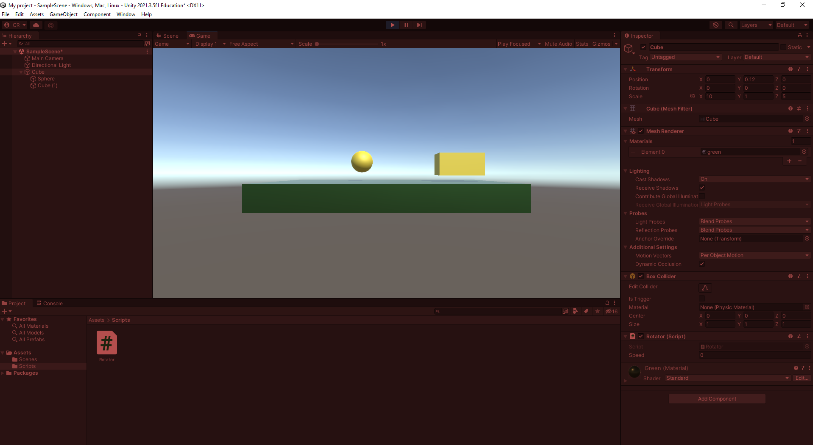

# Editor-Farbe im Play-Modus ändern
Veränderungen im Editor, welche welche mit aktivem Play-Modus getätigt werden, werden nach dem stoppen des Play-Modus wieder verworfen.

Um zu verhindern, dass der Play-Modus bei wichtigen Veränderungen ausversehen angeschaltet bleibt, werden wir den Editor während dem Play-Modus einfärben. Somit ist auf den ersten Blick ersichtlich, dass Veränderungen nur temporär sind.

Um den Editor einzufärben, begeben wir uns in die <i>Preferences</i>

Innerhalb der <i>Preferences</i> befindet sich der Reiter <i>Colors</i>.

Dort können wir unter <i>General</i> die <b>Playmode tint</b> verändern. Hier wählen wir eine offensichtliche Farbe nach eigener Präferenz (In diesem Beispiel rot).

